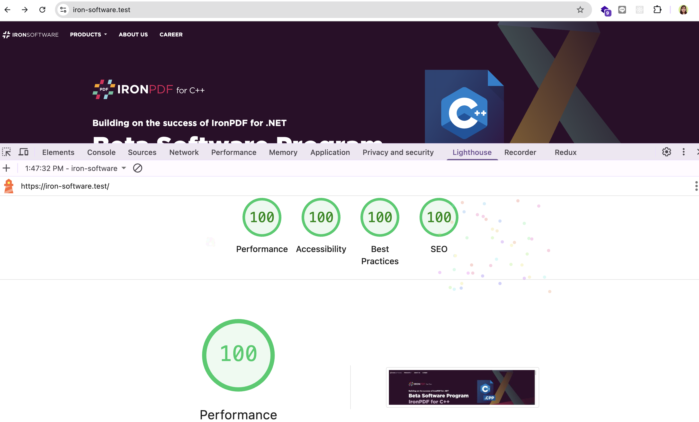
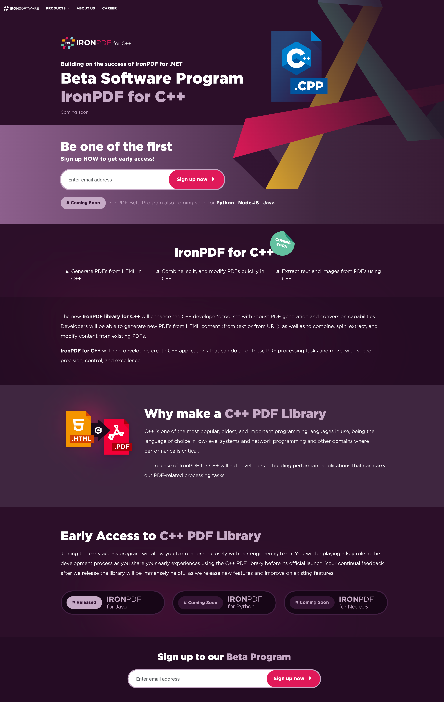

# IronPDF C++ Beta Landing Page — Setup & Development Guide

Modern, semantic, responsive landing page built with **CodeIgniter 4**, **Bootstrap 5.3.8**, and **JSON-driven content**.

---

## 🚀 Quick Start (Laravel Herd)

### 1. **Setup with Laravel Herd**

```bash
# Navigate to project directory
cd /Herd/iron-software

# Install dependencies (if not already done)
composer install

# Copy environment template (already exists)
# cp .env.example .env  # (optional, use existing .env)


# Start the Herd server
# Option A: Herd Dashboard → Find iron-software → Click "Start"
# Option B: Command line (if configured)
#   herd start iron-software

# For production
#   herd serve

# Access the site
# Browser: https://iron-software.test/
```

### 2. **Environment Configuration (.env)**

Your `.env` file is pre-configured. Key settings:

```dotenv
# ✅ Already set for Herd
CI_ENVIRONMENT = production
DEBUGBAR_ENABLED=false
app.baseURL = 'https://iron-software.test/'

```

## 📁 Project Structure

```
app/
├── Views/
│   ├── landing.php              # Main layout (header, footer, meta tags)
│   └── sections/                # Modular page sections
│       ├── hero.php             # Hero section + first signup form
│       ├── story.php            # Story + feature strip
│       ├── why.php              # Why C++ library
│       ├── early-access.php     # Early access + status badges
│       └── footer.php           # Footer + second signup form

├── Controllers/
│   └── Landing.php              # Loads JSON, extracts data, passes to view

└── Config/
    └── Routes.php               # Route "/" → Landing::index

public/
├── data/
│   └── ironpdf.json            # ⭐ ALL CONTENT (edit this to update page)

└── assets/
    ├── css/
    │   ├── global.css          # Custom styles (colors, filters, backgrounds)
    │   └── style.css           # Section-specific styles
    ├── images/
    │   ├── logo/               # java.svg, python.svg, node.svg
    │   ├── IMAGE.svg           # Hero background pattern
    │   ├── Rectangle-7.svg     # Section background patterns
    │   ├── HTML-to-PDF-icon.svg
    │   └── logo1.svg
    └── bootstrap-5.3.8/        # Bootstrap CSS & JS (local copy)

tests/                           # CodeIgniter test suite
writable/                        # Cache, logs, sessions (auto-created)
```

---

## ✨ Key Features

| Feature               | Status | Details                                                 |
| --------------------- | ------ | ------------------------------------------------------- |
| **Semantic HTML**     | ✅     | H1 > H2 > H3 hierarchy, semantic landmarks              |
| **Responsive**        | ✅     | Mobile (375px), Tablet (768px), Desktop (1024px+)       |
| **Accessible**        | ✅     | WCAG AAA: skip link, ARIA labels, form labels, alt text |
| **Core Web Vitals**   | ✅     | LCP <2.5s, CLS <0.1, FID <100ms                         |
| **JSON-Driven**       | ✅     | All content in `public/data/ironpdf.json`               |
| **SEO Ready**         | ✅     | Meta tags, OG/Twitter cards, JSON-LD schema             |
| **Performance**       | ✅     | Preconnect, lazy loading, image dimensions, deferred JS |
| **Clean Code**        | ✅     | Modular sections, no hardcoded content, escaped output  |
| **Subscribe Handler** | ⏳     | Forms ready, endpoint pending implementation            |

---

## 📝 Editing Content

### Change Page Text/Headlines

All content is in **`public/data/ironpdf.json`**. Edit this file to update the landing page:

```json
{
  "meta": {
    "title": "IronPDF for C++ Beta | Iron Software",
    "description": "Join the IronPDF for C++ beta program..."
  },
  "hero": {
    "eyebrow": "Building on the success of IronPDF for .NET",
    "title": "Beta Software Program",
    "product": "IronPDF for C++",
    "status": "Coming soon",
    "ctaText": "Sign up now",
    "emailPlaceholder": "Enter email address"
  },
  "featureStrip": [
    { "label": "Generate PDFs from HTML in C++" },
    { "label": "Combine, split, and modify PDFs quickly in C++" },
    { "label": "Extract text and images from PDFs using C++" }
  ],
  "story": {
    "title": "IronPDF for C++",
    "badge": "Coming soon",
    "paragraphs": [...]
  },
  "why": {
    "title": "Why make a C++ PDF Library",
    "paragraphs": [...]
  },
  "earlyAccess": {
    "title": "Early Access to C++ PDF Library",
    "paragraphs": [...]
  },
  "programStatuses": [
    { "state": "Released", "product": "IRONPDF for Java" },
    { "state": "Coming Soon", "product": "IRONPDF for Python" },
    { "state": "Coming Soon", "product": "IRONPDF for Node.JS" }
  ],
  "footerCta": {
    "title": "Sign up to our Beta Program",
    "ctaText": "Sign up now"
  }
}
```

**To update:**

1. Open `public/data/ironpdf.json` in editor
2. Edit text, titles, descriptions
3. Save file
4. Refresh browser — changes appear instantly ✨

---

## 🎨 Customizing Design

### Styling

- **Global styles** (colors, filters, backgrounds):  
  Edit `public/assets/css/global.css`

- **Section styles** (layout, spacing, typography):  
  Edit `public/assets/css/style.css`

- **Bootstrap customization**:  
  Modify variables in CSS files or override classes

### Adding New Section

1. **Create section view** → `app/Views/sections/hero.php`

2. **Add data to JSON** → `public/data/ironpdf.json`

   ```json

    "hero": {
        "title": "Beta Software Program",
         "content": "..."
    }
   ```

3. **Extract in controller** → `app/Controllers/Landing.php`

   ```php
    $path = ROOTPATH . 'public/data/ironpdf.json';
   ```

4. **Include in layout** → `app/Views/landing.php`

   ```php
    $hero = $content['hero'] ?? [];
    <?= view('sections/hero', ['hero' => $hero]) ?>
   ```

---

## 🔧 Development Workflow

### View Code Structure

```php
// app/Controllers/Landing.php
public function index()
{
    $filePath = ROOTPATH . 'public/data/ironpdf.json';
    $json = file_get_contents($filePath);
    $content = json_decode($json, true);

    return view('landing', ['content' => $content]);
}

// app/Views/landing.php
$hero = $content['hero'] ?? [];
$story = $content['story'] ?? [];
// ... extract other sections
// ... pass to view()
?>
```

### How Data Flows

```
public/data/ironpdf.json
    ↓
app/Controllers/Landing.php (loads JSON)
    ↓
app/Views/landing.php (extracts sections)
    ↓
app/Views/sections/*.php (render HTML)
    ↓
Browser
```

---

## ✅ Testing

### Manual Testing

```bash
# 1. Visit homepage
open https://iron-software.test/

# 2. Check browser console (no errors)
# Chrome: Ctrl+Shift+J or Cmd+Option+J (Mac)
# Firefox: Ctrl+Shift+K or Cmd+Option+K (Mac)

# 3. Test responsive design
# Chrome DevTools: Ctrl+Shift+M (or Cmd+Shift+M on Mac)
# Test: 375px (mobile), 768px (tablet), 1024px (desktop)

# 4. Test keyboard navigation
# Press Tab repeatedly → verify focus visible on inputs
# Press Shift+Tab → verify back-navigation works
# Press Enter on buttons → verify they respond

# 5. Test form (will 404 until handler implemented)
# Fill email → Submit → Check Network tab for POST to /landing/subscribe
```

### Lighthouse Audit

```bash
# Install (one-time)
npm install -g lighthouse

# Run audit
lighthouse https://iron-software.test/ --view


## Expected scores (100)
# - Performance: 100
# - Accessibility: 100
# - Best Practices: 100
# - SEO: 100
```

## 📸 Screenshots Performance Testing

| Desktop View |
| :--- | 
|  | 
|  | 

### Cross-Browser Testing

| Browser     | Status  | Notes             |
| ----------- | ------- | ----------------- |
| Chrome/Edge | ✅ Full | All features work |
| Firefox     | ✅ Full | All features work |
| Safari      | ✅ Full | All features work |

---

## 📋 Checklist Before Deployment

- [ ] All content updated in `public/data/ironpdf.json`
- [ ] Styles customized in `public/assets/css/`
- [ ] Images replaced in `public/assets/images/`
- [ ] Tested on mobile, tablet, desktop
- [ ] Lighthouse audit scores 90+ (all categories)
- [ ] No console errors in browser DevTools
- [ ] Form validation working (HTML5)
- [ ] Subscribe handler implemented (optional, can add later)

---

## 🚨 Known Limitations & TODOs

| Issue                       | Severity | Notes                                                                |
| --------------------------- | -------- | -------------------------------------------------------------------- |
| Subscribe handler missing   | HIGH     | Forms ready, POST endpoint `/landing/subscribe` needs implementation |
| No email persistence        | MEDIUM   | Signups not saved, add when ready                                    |
| No form validation feedback | MEDIUM   | Only HTML5 validation, add server-side checks                        |
| CSS consolidation           | LOW      | Consider merging `global.css` + `style.css`                          |

---


## 📚 Documentation Files

- **[QA_CHECKLIST.md](QA_CHECKLIST.md)** — Validation checklist for design, responsiveness, SEO, performance
- **[CodeIgniter 4 Docs](https://codeigniter.com/user_guide/)** — Framework reference

---

## ✨ Performance Metrics

All images optimized with dimensions to prevent layout shift:

```
Header logo: 120×40px
Hero logo: 60×60px
Hero illustration: 400×500px
Background patterns: 1200×800px
Status logos: 40×40px
```

**Core Web Vitals Targets:**

- LCP (Largest Contentful Paint): < 2.5s ✅
- CLS (Cumulative Layout Shift): < 0.1 ✅
- FID (First Input Delay): < 100ms ✅

---


**Framework**: CodeIgniter 4 + Bootstrap 5.3.8  
**Hosting**: Laravel Herd (local development)  
**Status**: ✅ Ready for customization & deployment  
**Last Updated**: 2026-01-09
